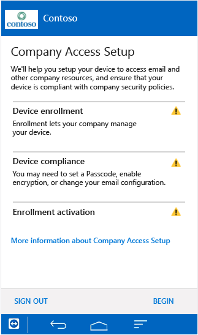
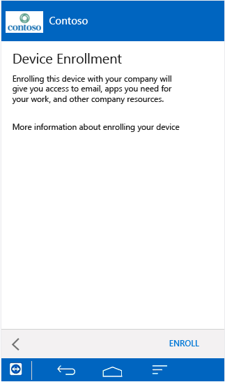
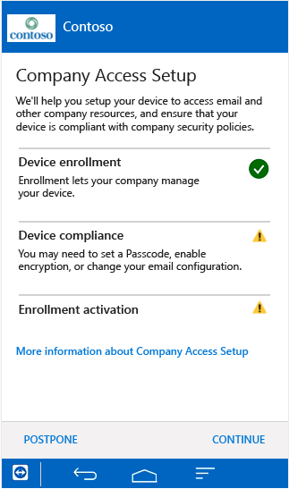
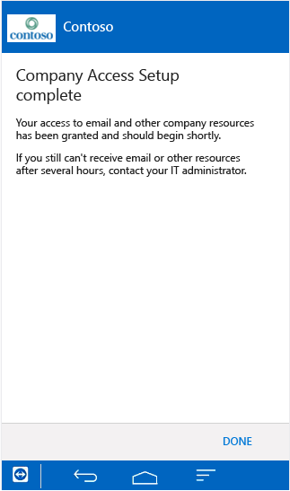
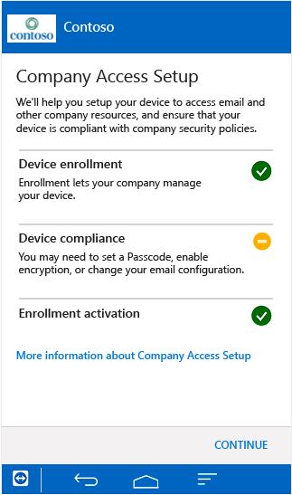

# Android

The enrollment process and the screens the user sees will be slightly different depending on the version of OS running on the end-user device. This topic describes the end-user experience for Android devices.

## Enrolling

1.  When they try to access email, the user first receives a quarantine email similar to this sample:

    

    The user clicks **Get started now** to begin enrolling their device.

    > [!NOTE]
    > If a user has not set a default browser for their device, they will be prompted during device enrollment and during enrollment activation to allow a link to open a browser window. When prompted, they must select the same browser each time or the enrollment process will fail.

2.  The user is prompted to install the Intune Company Portal app from the respective app store.

    

    After it installs, the user opens the app and signs in using their company credentials.

3.  On the Company Access Setup screen, the user clicks **Begin** to start setting up their device and checking whether it is compliant.

    

4.  On the Device Enrollment screen, the user clicks **Enroll** to start enrolling their device.

    

5.  Users must activate the device administrator by clicking **Activate** when prompted or the device enrollment procedure will cancel.

    

    Device enrollment begins. Depending on the device, a certificate installation prompt or a Samsung KNOX Privacy Policy prompt might appear during enrollment. These are necessary to allow you, the IT administrator, to remotely manage the device. The device is enrolled to Intune and establishes a device identity with Azure Active Directory.

    

6.  After enrollment is completed successfully, the user clicks **Continue** to start checking compliance on the device.

    

    If there is a compliance issue, the user is prompted to resolve the issue (such as creating a valid password) and to then click **Check Compliance** to continue.

    

7.  After the device is fully compliant, the user clicks **Continue** to initiate enrollment activation. This will connect the AAD device identity with the EAS ID provided by Exchange.

    > [!NOTE]
    > On Android, the default browser will appear for a few seconds during enrollment activation. If the user has not already selected a default browser, they are prompted to choose a browser. While completing Company Access Setup, the same browser must be selected by the user whenever prompted.

    

8.  Enrollment activation will complete and the user clicks **Done** to exit the enrollment and compliance verification process.

    

    After the user is enrolled and compliance is verified, email access should become available within a few minutes.

If the user follows those steps to enroll and become compliant and still cannot access their email on their mobile device, they can follow these additional steps to try and fix the issue:

1.  First, verify that their device is enrolled. If not, the user follows the steps above.

2.  Verify that the device is compliant by clicking **Check Compliance**. If a compliance error is identified, the user can follow the instructions specific to their mobile device about how to resolve it, such as resetting their password.

3.  Call the help desk.

## Issues and Solutions
Every 8 hours by default, devices are checked to ensure that they are still compliant. If a device that was previously compliant is later deemed to be noncompliant (for example, a compliance policy was added or changed), the user can follow these steps to get their device back in compliance:

1.  The user receives notification in email or on their device that the device is noncompliant. At this time, the device is quarantined in Exchange.

2.  When the user tries to access email, they see a quarantine email informing them that compliance issues must be fixed before they can get access. When the user clicks on the hyperlink in the quarantine email, it redirects them to the Company Access Setup screen in the Intune Company portal (via default browser and Google Play) where it shows that the device is not compliant.

    

3.  The user clicks **Continue** and is shown the compliance issue that is preventing them from accessing email.

    

4.  After they have fixed the issue, they click **Check Compliance** to verify that the problem is resolved.

5.  If the issue is fixed, the user clicks **Continue** to complete the process. Email access should become available again within a few minutes.

### Where to go from here
The end-user experience is slightly different on other mobile devices. You can learn more about the end-user experience for [iOS](../Solutions/end-user-experience-conditional-access-ios.md) and [Windows Phone](../Solutions/end-user-experience-conditional-access-winphone.md).
