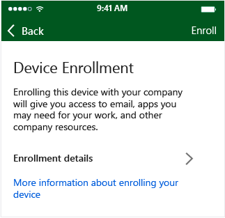

---
# required metadata

title: End-user experience of conditional access on iOS devices
description:
keywords:
author: craigcaseyMSFT
manager: swadhwa
ms.date: 04/28/2016
ms.topic: article
ms.prod:
ms.service:
ms.technology:
ms.assetid: 3c641ea8-2c0e-490e-b1de-831336f46d19

# optional metadata

#ROBOTS:
#audience:
#ms.devlang:
ms.reviewer:
ms.suite: ems
#ms.tgt_pltfrm:
#ms.custom:

---

# iOS

The enrollment process and the screens the user sees will be slightly different depending on the version of OS running on the end-user device. This topic describes the end-user experience for iOS devices.

## Enrolling

1.  If a user is already enrolled in Intune and is compliant, they will see no difference on iOS devices; they will continue to get access to email. If the user is not yet enrolled, they will see a quarantine message similar to this when they launch their mail app:

    

    The user clicks **Get started now** to begin enrolling their device.

2.  The user is prompted to install the Intune Company Portal app from the respective app store.

    

    After it installs, the user opens the app and signs in using their company credentials.

3.  On the Company Access Setup screen, the user clicks **Begin** to start setting up their device and checking whether it is compliant.

    

4.  On the Device Enrollment screen, the user clicks **Enroll** to start enrolling their device.

    

    During enrollment, the Mobile Device Management profile is installed to allow you, the IT administrator, to remotely manage the device. The user enters their password if prompted.

5.  On the Company Access Setup screen, the user clicks **Continue** to start checking compliance on the device.

    

    If there is a compliance issue, the user is prompted to resolve the issue (such as by creating a valid password) and to then click **Check Compliance** to continue.

    

6.  After the device is fully compliant, the user clicks **Continue** to proceed.

    

    After the user is enrolled and compliance is verified, email access should become available within a few minutes.

If the user follows those steps to enroll and become compliant and still cannot access their email on their mobile device, they can follow these additional steps to try and fix the issue:

-   First, verify that their device is enrolled. If not, the user follows the steps above.

-   Verify that the device is compliant by clicking **Check Compliance**. If a compliance error is identified, the user can follow the instructions specific to their mobile device about how to resolve it, such as resetting their password.

-   Call the help desk.

## Issues and Solutions
Every 8 hours by default, devices are checked to ensure that they are still compliant. If a device that was previously compliant is later deemed to be noncompliant (for example, a compliance policy was added or changed), the user can follow these steps to get their device back in compliance:

1.  The user receives notification in email or on their device that the device is noncompliant. At this time, the device is quarantined in Exchange.

2.  If the user tries to access email, they are redirected back to the Company Access Setup screen from the Intune Company portal where it shows that they are out of compliance.

    

3.  The user clicks **Continue** and is shown the compliance issue that is preventing them from accessing email.

    

4.  After they have fixed the issue, they click **Check Compliance** to verify that the problem is resolved.

5.  If the issue is fixed, the user clicks **Continue** to complete the process.

    

    Email access should become available again within a few minutes.

### Where to go from here
The end-user experience is slightly different on other mobile devices. You can learn more about the end-user experience for [Android](../Solutions/end-user-experience-conditional-access-android.md) and [Windows Phone](../Solutions/end-user-experience-conditional-access-winphone.md).
