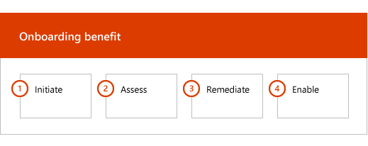
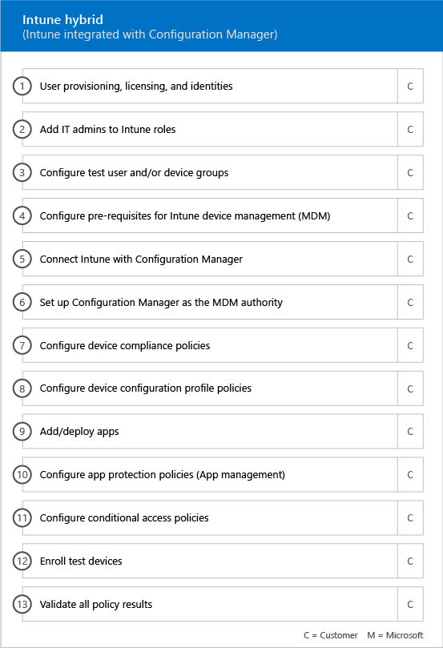

---
# required metadata

title: Onboarding and migration phases
description: Phases of the FastTrack Center Benefit
keywords:
author: NathBarn
ms.author: NathBarn
manager: angrobe
ms.date: 02/01/2017
ms.topic: article
ms.prod:
ms.service: microsoft-intune
ms.technology:
ms.assetid: e51f030b-8b08-4fea-96c9-d4ded435a264

# optional metadata

#ROBOTS: noindex
#audience:
#ms.devlang:
ms.reviewer:
ms.suite: ems
#ms.tgt_pltfrm:
#ms.custom: active-directory, ad-health-connect, multi-factor-authentication, microsoft-intune

---

# Onboarding and Migration Phases
When you use the [FastTrack Center Benefit Eligible Services and Plans](fasttrack-center-benefit-for-enterprise-mobility-suite-ems.md) to get Microsoft Azure Active Directory Premium and Microsoft Intune ready for use, there are several phases involved in the process. The following sections describe each phase of the onboarding process.

Onboarding has four primary phases:

## Initiate phase
After you purchase the appropriate number of licenses, follow the guidance from the purchase confirmation email to associate the licenses to your existing tenant or new tenant. Microsoft then verifies your eligibility for the FastTrack Center Benefit and tries to contact you to offer onboarding assistance. You can also request assistance from the [FastTrack Center](http://fasttrack.microsoft.com/) if you're ready to deploy these services for your organization.

To request assistance, sign in to the [FastTrack Center](http://fasttrack.microsoft.com/) with your work or school account, go to the dashboard, expand the **Need Help?** at the left of the screen, and then follow the prompts to complete your request. Once onboarding support starts, we set up a schedule of online meetings.

During this phase, we discuss the onboarding process, verify data, and set up a kick-off meeting.

## Assess phase

Once the onboarding process begins, the FastTrack Center works with you to assess your source environment and the requirements. Tools are run to assess your environment, and FastTrack Specialists guide you through assessing your on-premises Active Directory, Internet browsers, client devices' operating systems, Domain Name System (DNS), network, infrastructure, and identity system to determine if any changes are required for onboarding.

The FastTrack Center also connects you with guidance about how to drive successful adoption of the eligible services.

Based on your current setup, we provide a remediation plan that brings your source environment up to the minimum requirements for successful onboarding to EMS or its individual cloud services. We also set up appropriate checkpoint calls for the remediation phase.

## Remediate phase
You perform the tasks in the remediation plan on your source environment so that you meet the requirements for onboarding and adopting each service (as needed).

Before you begin the Enable phase, we jointly verify the outcomes of the remediation activities to make sure you’re ready to proceed.

## Enable phase
When all remediation activities are complete, the project shifts to configuring the core infrastructure for service consumption and to provisioning each eligible EMS cloud service.

**Enable phase - Core capabilities**

Core onboarding involves service provisioning and tenant and identity integration. It also includes steps for providing a foundation for onboarding online services such as Azure AD Premium and Intune.

> [!NOTE]
> A managed authentication method includes, but is not limited to Password Hash Sync.

> [!NOTE]
> Identity integration is a one time activity and does not include migrating or decommissioning of existing authentication methods, such as managed or federated. 

### Enable phase - Azure AD Premium

The Azure AD Premium environment can be set up by using the Azure Active Directory Connect tool directory synchronization and Active Directory Federation Services (AD FS) (as needed).

For Azure AD Premium scenarios that include synchronizing on-premises identities to the cloud, we help you by adding IT admins and users to your subscription, configuring management prerequisites, setting up Azure AD Premium, setting up directory synchronization with managed authentication and AD FS using the Azure AD Connect tool, configuring test users, and validating your core use cases for the service.

Azure AD Premium setup includes enabling the following features:

-   Self-Service Password Reset (SSPR).

-   Azure Multi-Factor Authentication (Azure MFA).

-   Up to three (3) or more Software as a Service (SaaS) application integrations with single sign-on (SSO) from the [Azure Active Directory Marketplace](https://azure.microsoft.com/marketplace/active-directory/).

-   Customized logon screen, including logo, text, and images.

-   Self-Service and Dynamic Groups (Groups).

-   Azure Active Directory Application Proxy.

-   Azure Active Directory Connect Health.

-   Identity Protection.

-   Privileged Identity Management.

-   Azure Active Directory Conditional Access.

-   Usage and security reports to administrators.

-   Administrative notification and alerts.

### Enable phase - Intune

For Intune, we guide you through getting ready to use Microsoft Intune to manage devices. The exact steps depend on your source environment and are based on your mobile device and mobile app management needs. The steps can include:

-   Licensing your end users. We also provide assistance on how to activate volume licenses for your Microsoft cloud service tenant (as needed).

-   Configuring identities to be used by Intune by leveraging either your on-premises Active Directory or cloud identities.

-   Adding users to your Intune subscription, defining IT admin roles, and creating user and device groups.

-   Configuring your Mobile Device Management (MDM) authority, based on your management needs, including:

    -   Setting Intune as your MDM authority when Intune is your only MDM solution or is in conjunction with Mobile Device Management for Office 365.

    -   Setting System Center Configuration Manager as your MDM authority if you have an existing implementation of Configuration Manager and you want to expand its management capabilities with Intune.

        > [!NOTE]
        > If you only want to leverage MDM over your end-users' owned devices, shared devices, or kiosk-type devices, setting up an MDM authority isn't required.

-   Providing MDM guidance for:

    -   Configuring tests groups to be used to validate MDM management policies.

    -   Configuring MDM management policies and services like:

        -   Application deployment for each supported platform through web links or deep links.

        -   Conditional access policies.

        -   Deployment of email, wireless networks, and virtual private network (VPN) profiles if you have an existing  certificate authority, Wi-Fi or VPN infrastructure in your organization.

        -   Setting up the Microsoft Intune Exchange Connector (when applicable).

    -   Enrolling devices of each [supported platform](https://technet.microsoft.com/library/dn600287.aspx) to your Intune or Configuration Manager with Intune service.

-   Providing Mobile Application Management (MAM) guidance about:

    -   Configuring MAM policies for each supported platform.

    -   Configuring conditional access policies for managed apps.

    -   Targeting the appropriate user groups with the above MAM policies.

    -   Using managed-applications usage reports.

-   Providing PC management guidance about:

    -   Installing the Intune client software (when needed).

    -   Using the software and hardware reports available in Intune.

Microsoft also connects you with guidance about how to drive successful adoption of the eligible services.

**Want to learn more?**

[Enterprise Mobility + Security](https://www.microsoft.com/en-us/cloud-platform/enterprise-mobility)
