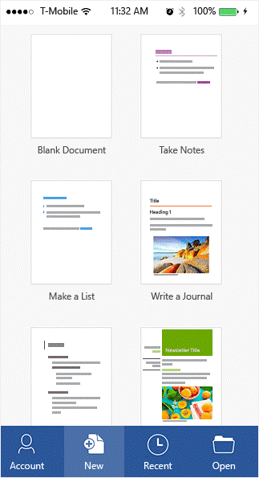
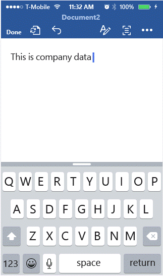
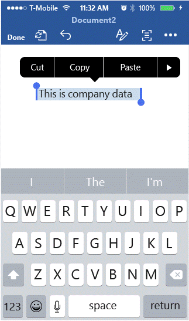
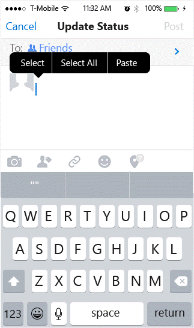
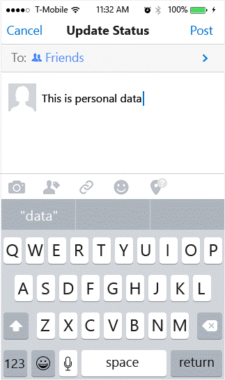

---
# required metadata

title: How to use applications with multi-identity support
description: How to use apps with multi-identity support
keywords:
author: craigcaseyMSFT
manager: jeffgilb
ms.date: 09/28/2016
ms.topic: article
ms.prod:
ms.service:
ms.technology:
ms.assetid: 586ecd93-b097-42a0-9229-bcf3b781021c

# optional metadata

ROBOTS: noindex
#audience:
#ms.devlang:
ms.reviewer:
ms.suite: ems
#ms.tgt_pltfrm:
#ms.custom:

---

# How to use apps with multi-identity support

In this scenario, we are using Microsoft Word as the example. You can apply these same steps to other apps included in Office 365.
1.	Open the **Word** app on your device. In this example, we are using an iOS device.
2.	Tap **New** to create a new Word document.

  

3.	Type a sentence of your choice and tap **Save**. You’ll be presented with two options for where to save the document: your personal location and your work location. App policies aren’t active at this stage since we haven’t yet established whether the document is for work or personal use.
4.	Save the document to your **work location**, like OneDrive for Business. Since OneDrive for Business is recognized as your work location, the document is now tagged as company data and policy restrictions are applied.

  

5.	Now, open the document you just saved to your work location and copy the text. Open your personal **Facebook** account and attempt to paste the copied text. You should not be able paste the content into the new Facebook post. The paste option is not greyed out, but nothing happens when you press **Paste**. This is because the policy restrictions prevent corporate data from being shared in personal apps.

  

  
6.	Next, create another new Word document by repeating steps 2 and 3. Type a sentence of your choice and, this time, save it to your personal location like **OneDrive - personal**. The document is tagged as personal, and corporate policy restriction do not apply.

  

7.	Open the document you just saved to your personal location and copy the text. Once again, open **Facebook** and paste the copied text. Since this document is tagged as personal, you should be able to paste the content into a Facebook post.

  

### Want to learn more?
See [Enterprise Mobility Suite](https://www.microsoft.com/en-us/server-cloud/enterprise-mobility/overview.aspx).
