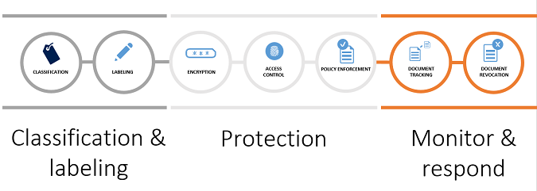
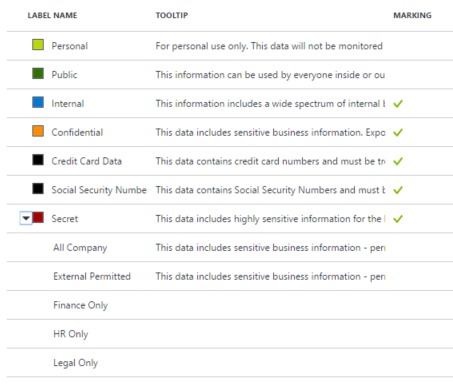

---
# required metadata

title: Secure data using classification, labeling and protection | Microsoft Docs
description: A scenario that describes how Enterprise Mobility + Security can be used to classify, label and protect data by leveraging Microsoft Azure Information Protection capabilities.
author: yuridio
ms.author: yurid
manager: swadhwa
ms.date: 02/21/17
ms.topic: solution
ms.prod:
ms.service: rights-management
ms.technology: techgroup-identity
ms.assetid: 65409d5c-4f1b-4026-86e9-e65e1c4fe2b4

# optional metadata

#ROBOTS:
#audience:
#ms.devlang:
ms.reviewer: v-craic
ms.suite: ems
#ms.tgt_pltfrm:
#ms.custom:

---

# Secure data using classification, labeling and protection

Nowadays information sharing is taking place from multiple devices and across organizational boundaries.  It becomes imperative to ensure that critical corporate data is not compromised in this process while enabling users to securely share what’s important for them to perform their jobs. With trends such as outsourcing, you may need to share company confidential data with contractors and vendors. Because not all content needs the same protection, companies are challenged to identify which data needs protection and which data does not.

Continue reading to learn more about how Enterprise Mobility + Security helps address this scenario.

## How can Enterprise Mobility + Security help you?

Enterprise Mobility + Security (EMS) is the only comprehensive cloud solution that protects corporate data on the device itself and beyond with four layers of protection across identities, devices, apps, and data. EMS helps you solve one of the key challenges in the mobile-first, cloud-first world – how to deliver secure data to employees on-the-go. With EMS, you will enable your employees to collaborate securely within and outside of your organization. EMS allows IT Administrators to leverage Azure Information Protection to help securing corporate data at the file level. By using this capability, they can rest assured the data is always protected–regardless of where it’s stored, with whom it’s shared, and whether it’s at rest or in transit.

## Recommended solution

Azure Information Protection lets organizations classify, label, and protect data at the time of creation or modification. With Azure Information Protection, users can:

- Classify data based on sensitivity, and add labels—manually or automatically
- Protect data using encryption, authentication and use rights
- Enable intuitive, non-intrusive experience for end users

The organization also has access to detailed tracking and reporting so they can see what’s happening with the shared data to manage it better. The following diagram summarizes the information protection lifecycle:

Watch this short video for a quick introduction on how Azure Information Protection makes it simpler to classify, label and protect information, even as it travels outside of your organization.

<iframe src="https://channel9.msdn.com/Shows/Mechanics/An-Introduction-to-Microsoft-Azure-Information-Protection/player" width="560" height="315" allowFullScreen frameBorder="0"></iframe>

## How to implement this solution

Follow these steps to implement data classification, labeling and protection using Azure Information Protection:

- Step 1: Preparing for data classification and protection
- Step 2: Configure information protection policies and labels
- Step 3: Implement content based automatic classification
- Step 4: Configure conditions for automatic and recommended classification

## How to secure data using classification, labeling and protection with Azure Information Protection

Companies need to identify which data needs protection and which data does not need the same level of protection. The steps that follows will guide you through core tasks that must be done to enable IT to implement Azure Information Protection.

### Step 1: Preparing for document protection and content classification

Before implementing this solution, review the [requirements for Azure Information Protection](/information-protection/get-started/requirements) and ensure that Azure Rights Management is activated. If it is activated, you should see the following screen in Azure Portal:

When you activate Azure Rights Management, you can protect important data by using applications and services supported by this information protection solution. You can also manage and monitor protected files and emails that your organization owns. You must activate Azure Rights Management before you can use the Rights Management features within Office, SharePoint, and Exchange to protect sensitive or confidential files.

### Step 2: Configure information protection policies and labels

When planning to implement information protection policies and labels, use the following guidelines:

- Classify data based on sensitivity
- Start with the data that is most sensitive
- IT can set automatic rules; users can complement it
- Associate actions such as visual markings and protection

The following diagram has an example of how this could be implemented:

Azure Information Protection comes with default labels, however you can [customize](/information-protection/deploy-use/configure-policy-new-label) and create your own labels or sub-labels that users see on the Information Protection bar.

> [!IMPORTANT]
> Labels are metadata written to documents. Labels are in clear text so that other systems such as a DLP engine can read it.

In the following example, you can see custom sub-labels that were created under the **Secret** label:

Once you define how you will be using your labels (default or custom ones), [configure a label to apply Rights Management protection](/information-protection/deploy-use/configure-policy-new-label).

### Step 3: Implement content based automatic classification

With Azure Information Protection, data classification and protection controls are integrated into Office and other common applications. This integration provides simple one-click options to secure data that users are working on. In the Azure portal, you can apply predefined patterns, such as “Credit card numbers” or “USA Social Security Numbers”, as a condition for automatic classification. Alternately, you can use text patterns and regular expressions to define a custom string or pattern.

When you configure conditions for a label, you can automatically assign a label to a document/email or, you can prompt users to select the label that you recommend. Read [How to configure conditions for automatic and recommended classification for Azure Information Protection](/information-protection/deploy-use/configure-policy-classification) for more information on how to perform this configuration.

### Step 4: Configure conditions for automatic and recommended classification

Policies can be set by IT Admins for automatically applying classification and protection to data. Policies can also be based on the content you’re working on and it can be configured to prompt users for suggested classification. The list of built-in conditions are:

- SWIFT Code
- Credit Card Number
- ABA Routing Number
- USA Social Security Number (SSN)
- International Banking Account Number (IBAN)

Read [Information about the built-in conditions](/information-protection/deploy-use/configure-policy-classification#information-about-the-built-in-conditions) for more details about this type of implementation.
