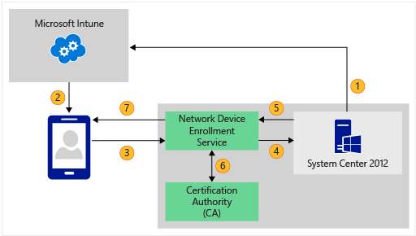

# Certificate management options

>[!NOTE]
>This topic is part of a larger design considerations guide. If you'd like to start at the beginning of the guide, check out the [main topic](mdm-design-considerations-guide.md). To get a downloadable copy of this entire guide, visit the [TechNet Gallery](https://gallery.technet.microsoft.com/Mobile-Device-Management-7d401582).

Using digital certificate management and certificate profiles is supported both by <externalLink><linkText>Intune</linkText><linkUri>https://technet.microsoft.com/library/dn818904.aspx</linkUri></externalLink> standalone and <externalLink><linkText>hybrid Intune and ConfigMgr</linkText><linkUri>https://technet.microsoft.com/library/dn261202.aspx</linkUri></externalLink> deployment scenarios. These features allow you to deploy trusted root certificates to mobile devices, as well as Simple Certificate Enrollment Protocol (SCEP) based profiles that instruct mobile devices to get additional certificates from a NDES server in your organization.

Since SCEP is natively supported by iOS, Windows 10 and 8.1, and Windows Phone 10 and 8.1, and is also supported through the <token>Microsoft Intune Company Portal</token> app for Android, using this enrollment protocol has the advantage of having the private key generated directly on the mobile device. The private key is never generated, cached, or stored by either <token>ConfigMgr</token> or by <token>Intune</token> - which helps to keep the mobile device secure.</para><para>

Figure 7 shows how Intune and ConfigMgr use the NDES to provide secure certificate provisioning to mobile devices using SCEP:

**Secure certificate provisioning**

1. A policy that includes the properties of the certificate for SCEP enrollment is created on the <token>Intune</token> service. </para></listItem><listItem><para><token>
2. Intune</token> converts the policy to a platform mobile device management protocol (like OMA-DM for Windows 10 and Windows 8.1) and sends it to the device</para></listItem><listItem><para>
3. The mobile device receives the policy and initiates an enrollment request from NDES</para></listItem><listItem><para>
4. NDES forwards the request to <token>ConfigMgr</token></para></listItem><listItem><para><token>
5. ConfigMgr</token> compares the request attributes of the SCEP request for an authentication match and sends confirmation back to NDES.</para></listItem><listItem><para>
6. NDES sends a certificate issuance request to the CA and it sends the certificate to the NDES role.</para></listItem><listItem><para>
7. NDES role sends the certificate to the device.

Depending on how you answered the questions in Task 3, you should be able to determine how you want certificates managed in the mobile device management solution. Currently, <token>MDM for Office 365</token> doesn’t support managing certificate profiles for mobile devices. 

Table 11 below will help you understand the advantages and disadvantages of the certificate profile management for <token>Intune</token> and the hybrid <token>Intune</token> with <token>ConfigMgr</token> deployment scenario:

</para><para><legacyBold>Table 11</legacyBold></para><table border="1"><thead><tr><TD><para>Certificate management options</para></TD><TD><para>Advantages</para></TD><TD><para>Disadvantages</para></TD></tr></thead><tbody><tr><TD><para><token>Intune</token> (standalone)</para></TD><TD><list class="bullet"><listItem><para>Supports certificate profiles on all major mobile device operating systems (Android, iOS, Windows 10, Windows 8.x, and Windows Phone)</para></listItem><listItem><para>Platform supports the Simple Certificate Enrollment Protocol (SCEP)</para></listItem><listItem><para>Certificate profiles can automatically configure mobile devices so that company resources can be accessed without having to install certificates manually or use a non-approved security process</para></listItem><listItem><para>Certificates can be automatically revoked when the device is retired from management, selectively wiped, or block from the management hierarchy</para></listItem></list></TD><TD><list class="bullet"><listItem><para>To use certificate profiles, some existing on-premises infrastructure must be in place. You must integrate the following on-premises infrastructure with <token>Intune</token>:</para><list class="bullet"><listItem><para>A server that runs the Network Device Enrollment Service</para></listItem><listItem><para>An Enterprise Certification Authority</para></listItem><listItem><para>The <token>Intune</token> NDES Connector, which installs on the server that runs NDES</para></listItem></list></listItem></list></TD></tr><tr><TD><para><token>MDM for Office 365</token></para></TD><TD><list class="bullet"><listItem><para>Not available</para></listItem></list></TD><TD><list class="bullet"><listItem><para>Not available</para></listItem></list></TD></tr><tr><TD><para>Hybrid (<token>Intune</token> with <token>ConfigMgr</token>)</para></TD><TD><list class="bullet"><listItem><para>All the advantages of <token>Intune</token> standalone, plus the following:</para><list class="bullet"><listItem><para>Also supports managing certificates for non-mobile devices</para></listItem></list></listItem></list></TD><TD><list class="bullet"><listItem><para>To use certificate profiles, some existing on-premises infrastructure must be in place. You must integrate the following on-premises infrastructure with <token>Intune</token>:</para><list class="bullet"><listItem><para>A server that runs the Network Device Enrollment Service</para></listItem><listItem><para>An Enterprise Certification Authority</para></listItem><listItem><para>The <token>Intune</token> NDES Connector, which installs on the server that runs NDES</para></listItem></list></listItem></list></TD></tr></tbody></table><para>

For more details about mobile device certificate management options, read how to <externalLink target="_blank"><linkText>enable certificate profiles</linkText><linkUri>https://technet.microsoft.com/library/dn818904.aspx</linkUri></externalLink> in <token>Intune</token> and compare these requirements and procedures to <externalLink target="_blank"><linkText>enabling certificate profiles</linkText><linkUri>https://technet.microsoft.com/library/dn261202.aspx</linkUri></externalLink> in <token>System Center 2012 R2 Configuration Manager</token>.</para></content>
</section></sections></section><section>

