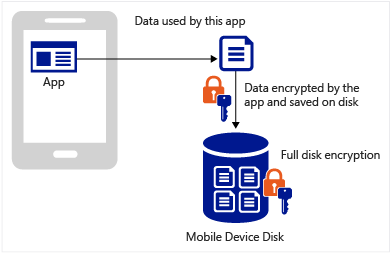

# Data Encryption

>[!NOTE]
>This topic is part of a larger design considerations guide. If you'd like to start at the beginning of the guide, check out the [main topic](mdm-design-considerations-guide.md). To get a downloadable copy of this entire guide, visit the [TechNet Gallery](https://gallery.technet.microsoft.com/Mobile-Device-Management-7d401582).

Now that you’ve answered the questions in Task 1 regarding the requirements for data encryption at rest and in transit, next you’ll evaluate the options that are available to address each requirement. Even when the data is at rest, it can be encrypted in different ways, as shown in the figure below.

## Different levels of encryption

You can use full disk encryption or encryption based on the data handled by an app. [ConfigMgr](https://technet.microsoft.com/library/dn919655.aspx) allows you to enforce policies that will perform file encryption on mobile devices. Although some mobile devices, like Windows Phone 8, are automatically encrypted, others only encrypt data if another option is enabled. For example, on iOS devices, the encryption takes place automatically only after you configure the setting to require a password on the device. 

Windows 10 Mobile uses device encryption, based on BitLocker technology, to encrypt all internal storage, including operating system and data storage partitions. The user can activate device encryption, or the IT department can activate and enforce encryption for company-managed devices through MDM tools. When device encryption is turned on, all data stored on the phone is encrypted automatically. A Windows 10 Mobile device with encryption turned on helps protect the confidentiality of data stored if the device is lost or stolen. Read Windows 10 Mobile security guide for more information.

>[!NOTE] For more information about the mobile devices that can have encryption enabled using ConfigMgr, read [Compliance Settings for Mobile Devices in Configuration Manager](https://technet.microsoft.com/library/dn376523.aspx).

For apps that are associated with an Intune mobile application management policy, encryption is provided by Microsoft. Data is encrypted synchronously during file I/O operations according to the setting in the mobile application management policy. On Android devices, managed apps use AES-128 encryption in Cipher Block Chaining (CBC) mode utilizing the platform cryptography libraries, which is not FIPS 140-2 certified. 

This option allows you to specify that all data associated with a particular app will be encrypted, including data stored on external media, such as SD cards. The same capability is also available with [MDM for Office 365](https://technet.microsoft.com/library/ms.o365.cc.devicepolicysupporteddevice.aspx). 

Public cloud storage services, such as OneDrive for Business, can also be integrated with Intune Standalone and also with [System Center 2012 R2 Configuration Manager SP1](https://technet.microsoft.com/library/mt131422.aspx). You can deploy the OneDrive for Business app to the user’s device and then all documents in the user’s OneDrive for Business account will be encrypted. 

Most MDM solutions use SSL to protect data in transit, so you’ll just need to decide if you will be using an existing PKI to issue certificates or if you will be using a third-party vendor certificate authority (CA). The advantage of using a third party CA is that users using their own device to access company’s resources will automatically trust a well-recognized public CA. 

| **MDM option**                 | **Advantages**                                                                                                                                                | **Disadvantages**                                                                                                                                                           |
|--------------------------------|---------------------------------------------------------------------------------------------------------------------------------------------------------------|-----------------------------------------------------------------------------------------------------------------------------------------------------------------------------|
| **Intune (standalone)**            | -   Encrypt data associated with apps controlled by Intune management policy                                                                                  | -   Does not include native encryption for mobile device storage                                                                                                            |
|                                |                                                                                                                                                               | -   No integration with current on-premises MDM platform means an additional management interface for you to use                                                            |
| **MDM for Office 365**             | -   Encrypt data based on the mobile device platform capability                                                                                               | -   No integration with current on-premises MDM platform means an additional management interface for you to use                                                            |
| **Hybrid (Intune with ConfigMgr)** | -   Encrypt data associated with apps controlled by Intune management policy                                                                                  | -   If the organization does not have a current on-premises ConfigMgr infrastructure, it will require to plan, install and configure this platform prior to the integration |
|                                | -   Encrypt mobile device storage                                                                                                                             |                                                                                                                                                                             |
|                                | -   Provides more granular control of what can be encrypted on mobile devices and how the encryption is done, including selection of the encryption algorithm 
                                                                                                                                                                                                 
                                  -                                                                                                                                                              |                                                                                                                                                                             |
|                                | -   Centralized management for mobile device configuration settings for cloud-based and on-premises devices                                                   |                                                                                                                                                                             |

For more information about how to combine Intune and ConfigMgr’s capabilities to increase data protection and configure encryption, read [Managing Encryption on Mobile Devices with Configuration Manager and Intune](http://blogs.technet.com/b/pauljones/archive/2014/08/04/managing-encryption-on-mobile-devices-with-configuration-manager-and-intune.aspx).