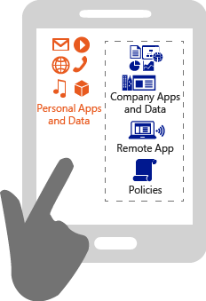
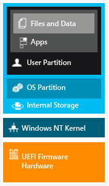

# Data segregation

>[!NOTE]
>This topic is part of a larger design considerations guide. If you'd like to start at the beginning of the guide, check out the [main topic](mdm-design-considerations-guide.md). To get a downloadable copy of this entire guide, visit the [TechNet Gallery](https://gallery.technet.microsoft.com/Mobile-Device-Management-7d401582).

Data segregation is important, not only for your organization, but also to keep your user’s personal information private. Data segregation helps you to remove all company apps and data from a device that belongs to a user, without affecting the user’s personal data (see figure below).

## User’s personal data is isolated from company’s data

By keeping separate all apps, company data, and policies that were deployed by the MDM solution, those can be removed from the device if necessary without affecting a user’s personal content and apps by using selective wipe. 

>[!TIP] Read [Help protect your data with remote wipe, remote lock, or passcode reset using Microsoft Intune](/intune/deployuse/help-protect-your-data-with-remote-wipe,-remote-lock,-or-passcode-reset-using-microsoft-intune) for more about how remote wipe will behave in other platforms like iOS and Android 

Selective wipe for mobile device data management is included in Windows Server 2012 R2 and Windows 8.1. It works by linking resources that help Exchange Server and Microsoft Intune administrators to manage enterprise data on devices and to develop apps that can use [Windows Selective Wipe](https://technet.microsoft.com/library/dn486874.aspx) capabilities.  Windows Phone 8 and later supports separating data in the internal storage.

Read more about Windows Phone 8.1 security capabilities by downloading the [Windows Phone 8.1 Security Overview](http://www.microsoft.com/download/details.aspx?id=42509)

Data segregation can be challenging if users switch between personal accounts and corporate accounts on their mobile devices. In a BYOD scenario, it’s common for users to use multiple credentials to perform different tasks on their device. 

Enterprise Data Protection (EDP) provides data separation but neither uses containers nor requires a special version of an app to access business data, and then a second instance of it to access personal data. There are no containers, partitions, or special folders to physically separate personal and business data. Instead, Windows 10 Mobile is the access control broker, identifying enterprise data because it’s encrypted to the enterprise. 

EDP provides data separation by virtue of encrypting enterprise data. Read [Enterprise data protection (EDP) overview](https://technet.microsoft.com/library/dn985838.aspx) for more information. Intune EDP policies will manage the list of apps protected by EDP, enterprise network locations, protection level, and encryption settings.

When a user installs and signs in to an app that supports multiple identities (multi-identity) on an Intune-managed device, such as Outlook, Intune checks to see if the account they’re using matches the managed account on the device. If the account is managed, and there is also a policy for the app and the user, then the policy settings protect data in that account. When the user adds personal accounts to the app, those accounts are outside of Intune management and protection. This allows personal use of the application without compromising corporate protection. Read [Protect data using mobile application management policies with Microsoft Intune](/intune/deployuse/configure-and-deploy-mobile-application-management-policies-in-the-microsoft-intune-console) for more information about multi-identity capability in Intune. 

The table below compares selective wipe features available with different MDM solutions to help you choose the MDM solution that best fits your organization’s data segregation requirements.

## Intune (standalone)

**Advantages**

- Allows you to perform selective wipes to remove only company data located on mobile devices
- Allows you to perform factory resets and fully wipe mobile devices
- Support for multi-identity apps

**Disadvantages**

- Does not include native encryption for mobile device storage
- No integration with current on-premises MDM platform means an additional management interface for you to use

## Office 365 with MDM

**Advantages**

- Allows you to perform factory resets and fully wipe Android, Windows Phone, and iOS devices
- Allows you to perform selective wipes on Android, Windows Phone, and iOS devices to remove only company data from mobile devices

**Disadvantages**

- No integration with current on-premises MDM platform means an additional management interface for you to use

## Hybrid (Intune with ConfigMgr)

**Advantages**

- Allows you to perform selective wipes to remove only company data from mobile devices
- Allows you to perform factory resets and fully wipe mobile devices
- Support for multi-identity apps
- Single management console to manage cloud based and on-premises mobile devices

**Disadvantages**

- If the organization does not have a current on-premises ConfigMgr infrastructure, it will require to plan, install and configure this platform prior to the integration

Make sure to read the article [Help protect your data with remote wipe, remote lock, or passcode reset using Microsoft Intune](/intune/deployuse/help-protect-your-data-with-remote-wipe,-remote-lock,-or-passcode-reset-using-microsoft-intune) to understand how data is removed and retained after a selective wipe for each mobile device platform. If you have a hybrid environment, consult the article [How to remote wipe mobile devices using Configuration Manager](https://technet.microsoft.com/library/dn956981.aspx) to understand how ConfigMgr can be used to accomplish this task.