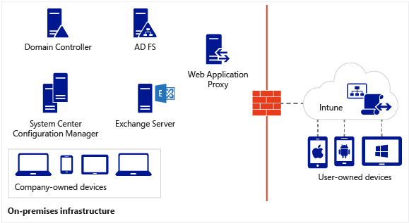

---
# required metadata

title: Mobile Device Management Design Considerations Guide
description:
keywords:
author: andredm7
manager: swadhwa
ms.date: 05/31/2016
ms.topic: article
ms.prod:
ms.service:
ms.technology:
ms.assetid: 7083b6b8-27a3-427b-b505-25d007d63cdd

# optional metadata

#ROBOTS:
#audience:
#ms.devlang:
ms.reviewer: 
ms.suite: ems
#ms.tgt_pltfrm:
#ms.custom:

---

# Mobile Device Management Design Considerations Guide

With all of the different design and configuration options for mobile device management (MDM) solutions, it’s sometimes difficult to determine which solution will best meet the needs of your organization. This design guide will help you to understand MDM design requirements and will detail a series of steps and tasks that you can follow to design a MDM solution that best fits the business and technology needs for your organization. 

## Getting started

Throughout the steps and tasks, this guide will present the relevant technologies and feature options available to organizations to meet functional and service quality (such as availability, scalability, performance, manageability, and security) level requirements.

Specifically, the goals of this guide are to help you answer the following questions:

- What questions do I need to answer to drive adoption of a mobile device management solution that best meets my business requirements?
- What is the sequence of activities I should complete to design a mobile device management solution for my organization?
- What Microsoft mobility management technology and configuration options are available to help me meet my requirements, and what are the trade-offs between those options?

**Who is this guide intended for?** Information technology architects and professionals responsible for designing a mobile device management solution for medium or large organizations.

**How can this guide help you?** You can use this guide to understand how to design a mobile device management solution that is able to manage company-owned devices as well as user-owned devices in different form factors.

**Example of a hybrid Intune and System Center Configuration Manager MDM solution**

The figure above is an example of a hybrid management solution, where it’s leveraging cloud services to integrate with on-premises capabilities in order to manage all types of devices, regardless of their location. Although this is a very common scenario, every organization’s MDM design might be different than the example due to each organization’s unique management requirements.
 
This guide details a series of steps and tasks that you should follow to assist you in designing a customized MDM solution that meets your organization’s unique requirements. Throughout the following steps and tasks, this guide covers the relevant technologies and feature options available to you to meet the functional and service quality level requirements for MDM. 

Though this guide can help you design a MDM solution, it does not discuss specific implementation or operations options for the management solutions. You can find detailed deployment and configuration steps [Microsoft Intune](/Intune/), [Mobile Device Management for Office 365](https://technet.microsoft.com/library/ms.o365.cc.devicepolicy.aspx), and [Microsoft System Center Configuration Manager](https://technet.microsoft.com/library/cc507089.aspx) in the docs.microsoft.com and TechNet libraries using the links available in the **Next steps and additional resources** section located at the end of this guide.

**Assumptions:** You have some experience with Microsoft Intune, System Center 2012 R2 Configuration Manager (ConfigMgr), Windows Server 2012 R2, and mobile devices running Android, iOS, and Windows Phone. You may have even deployed one of these solutions in an initial MDM test or limited production environment. In this guide, we assume you are looking for how these solutions can best meet your business needs on their own or in an integrated solution.

## MDM design considerations
This guide covers a set of steps and tasks that you can follow to design a solution that best meets your requirements. The steps are presented in an ordered sequence. However, design considerations you learn in later steps may prompt you to change decisions you made in earlier steps as your design matures or due to conflicting design choices. We’ll alert you to potential design conflicts throughout this guide.

You will develop a mobile device management design that best meets your requirements only after iterating through the following steps as many times as necessary to incorporate all of the considerations within this guide: 

- [Step 1: Identify your mobile device management requirements](mdm-step-1-identify-your-mobile-device-management-requirements.md)
- [Step 2: Plan for mobile device management](mdm-step-2-plan-for-mobile-device-management.md)
- [Step 3: Plan for securing mobile devices](mdm-step-3-plan-enhancing-mobile-devices-protection.md)
- [Step 4: Plan for Software as a Service mobile device management](mdm-step-4-plan-for-software-as-a-service-mobile-device-management.md)
- [Next steps and additional resources](mdm-next-steps-and-additional-resources.md)
        
## Looking for a downloadable version?
Get a downloadable copy of this entire guide at the [TechNet Gallery](https://gallery.technet.microsoft.com/Mobile-Device-Management-7d401582).
