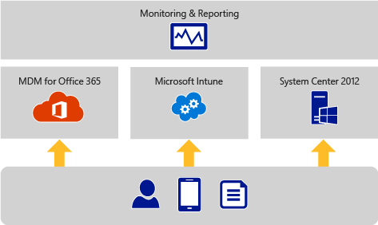

# Device monitoring options

>[!NOTE]
>This topic is part of a larger design considerations guide. If you'd like to start at the beginning of the guide, check out the [main topic](mdm-design-considerations-guide.md). To get a downloadable copy of this entire guide, visit the [TechNet Gallery](https://gallery.technet.microsoft.com/Mobile-Device-Management-7d401582).

Monitoring and understanding the status and configuration of all mobile devices managed by your organization helps you discover problems and non-compliance, and manage device inventory. Without detailed reports on hardware, software, and compliance status, it’s impossible to make sure that your device policies are actually in place and working correctly. Proactive monitoring helps mitigate small problems before they become larger and more costly.

<externalLink target="_blank"><linkText>Intune</linkText><linkUri>https://technet.microsoft.com/library/dn646951.aspx</linkUri></externalLink>, <externalLink target="_blank"><linkText>MDM for Office 365</linkText><linkUri>https://technet.microsoft.com/library/faa7d8e5-645d-4d59-839c-c8d4c1869e4a(v=technet.10).aspx</linkUri></externalLink>, and a <externalLink target="_blank"><linkText>hybrid deployment</linkText><linkUri>https://technet.microsoft.com/library/gg699377.aspx</linkUri></externalLink> of <token>Intune</token> and <token>ConfigMgr</token> all include monitoring and reporting to help manage devices, users, and compliance with your organization’s policies and procedures. Using built-in reports together with customized reports, you can monitor mobile device management in areas such as:

- Update reports for software
- Software inventory reports
- Hardware inventory reports
- Licensing reports
- Non-compliance reports

Depending on how your infrastructure is set up, you may be able to create a variety of reports to help you monitor your organization. <token>Intune</token>-based monitoring and reporting capabilities are the backbone for reports in <token>MDM for Office 365</token>, as well as <token>Intune</token> standalone deployments. These reports can also be tightly integrated with the reporting capabilities of <token>ConfigMgr</token> when it’s connected to <token>Intune</token> in a hybrid deployment. Each product, as shown below, has different but complementary reporting capabilities. It’s important to explore the nuances of the reporting capabilities of each mobile device management solution to help make sure you choose a solution that has the reports that you need.</para><mediaLink>
<image xlink:href="1047aa81-9c0e-4e4b-8acc-53cc33b33d5a"/>
</mediaLink><para><legacyBold>

**Integrated mobile device monitoring and reporting**

The answers you gave to the questions in Task 2 can help you determine your monitoring and reporting needs for your mobile devices. Table 8 below shows the advantages and disadvantages of the monitoring and reporting features in each MDM solution.

</para><para><legacyBold>Table 8</legacyBold></para><table border="1"><thead><tr><TD><para>Monitoring options</para></TD><TD><para>Advantages</para></TD><TD><para>Disadvantages</para></TD></tr></thead><tbody><tr><TD><para><token>Intune</token> (standalone)</para></TD><TD><list class="bullet"><listItem><para>Monitoring overview/dashboard</para></listItem><listItem><para>Alerts when errors are detected on direct managed network devices</para></listItem><listItem><para>An <token>Intune</token> service RSS feed can notify you about problems with the service and upcoming maintenance</para></listItem><listItem><para>Three levels of alerts (critical, warning, Informational) with thresholds and email alert notifications</para></listItem><listItem><para>Can filter alerts by device type</para></listItem><listItem><para>Can review the status of any managed device</para></listItem><listItem><para>Can monitor details in the following areas:</para><list class="bullet"><listItem><para>System</para></listItem><listItem><para>OS</para></listItem><listItem><para>Storage</para></listItem><listItem><para><token>Exchange ActiveSync</token></para></listItem><listItem><para>System enclosure</para></listItem><listItem><para>Network</para></listItem><listItem><para>Service</para></listItem></list></listItem></list></TD><TD><list class="bullet"><listItem><para>Email alerts only, no text-based or voice alerts</para></listItem></list></TD></tr><tr><TD><para><token>MDM for Office 365</token></para></TD><TD><list class="bullet"><listItem><para>Monitoring overview/dashboard</para></listItem><listItem><para>Three levels of alerts (critical, warning, Informational) with thresholds and email alert notifications</para></listItem><listItem><para>Can filter alerts by device type</para></listItem><listItem><para>Can review the status of any managed device</para></listItem></list></TD><TD><list class="bullet"><listItem><para>Mobile device compliance status reports only</para></listItem></list></TD></tr><tr><TD><para>Hybrid (<token>Intune</token> with <token>ConfigMgr</token>)</para></TD><TD><list class="bullet"><listItem><para>All the monitoring and reporting features of <token>Intune</token> standalone, plus the following:</para><list class="bullet"><listItem><para>Comprehensive, threshold-based, consolidated monitoring and reporting for all your organization’s devices, including non-mobile and non-<token>Intune</token> enrolled devices</para></listItem><listItem><para>Advanced reporting capabilities of SQL Server Reporting Services (SSRS) and the rich authoring experience provided by Reporting Services Report Builder</para></listItem></list></listItem></list></TD><TD><list class="bullet"><listItem><para>Requires additional configuration to connect <token>Intune</token> with the on-premises <token>ConfigMgr</token> infrastructure</para></listItem><listItem><para>For organizations that don’t have a current <token>ConfigMgr</token> infrastructure configured, it will need to be planned, installed and configured prior to integrating with <token>Intune</token></para></listItem></list></TD></tr></tbody></table><para>

Explore the details about mobile device monitoring options by reviewing the following:</para><list class="bullet"><listItem><para><token>Intune</token>: How to <externalLink target="_blank"><linkText>monitor mobile devices</linkText><linkUri>https://technet.microsoft.com/library/jj733634.aspx</linkUri></externalLink> and <externalLink target="_blank"><linkText>manage reporting</linkText><linkUri>https://technet.microsoft.com/library/dn646951.aspx</linkUri></externalLink></para></listItem><listItem><para><token>ConfigMgr</token>: <externalLink target="_blank"><linkText>Monitoring mobile devices</linkText><linkUri>https://technet.microsoft.com/library/gg682128.aspx</linkUri></externalLink> and <externalLink target="_blank"><linkText>manage reporting</linkText><linkUri>https://technet.microsoft.com/library/gg699377.aspx</linkUri></externalLink></para></listItem><listItem><para><token>MDM for Office 365</token>: <externalLink><linkText>Overview and device management tasks</linkText><linkUri>https://technet.microsoft.com/en-us/library/ms.o365.cc.devicepolicy.aspx</linkUri></externalLink></para></listItem></list></content>

