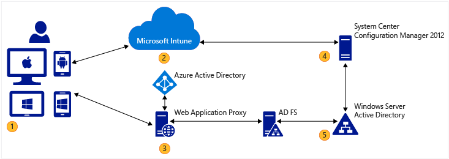

# Device provisioning options

>[!NOTE]
>This topic is part of a larger design considerations guide. If you'd like to start at the beginning of the guide, check out the [main topic](mdm-design-considerations-guide.md). To get a downloadable copy of this entire guide, visit the [TechNet Gallery](https://gallery.technet.microsoft.com/Mobile-Device-Management-7d401582).

When a user can use and enroll their own device, this increases the requirements for both the user and IT, and impacts several areas. For example, Figure 4 shows an overview of the enrollment process for an organization using both <token>Intune</token> and <token>ConfigMgr</token>. This example outlines the certificate, web application, and synchronization considerations that you’ll need to consider when planning your solution:

**Overview of the enrollment process for mobile devices using hybrid Intune and ConfigMgr**

1. With <token>Windows Server 2012 R2</token>, a new concept known as device registration was introduced.  Users can register their devices for single sign-on and access to corporate data using Workplace Join.  As part of this registration process, a certificate is installed on the device. In return for registering their device and making in known to the device management solution, the user gains access to corporate resources that were previously not available outside of their domain-joined PC.
2. Users can enroll devices which configure the device for management with <token>Intune</token> <externalLink target="_blank"><linkText>using the Company Portal</linkText><linkUri>https://technet.microsoft.com/library/dn646957.aspx</linkUri></externalLink>, and then leverage the <token>Microsoft Intune Company Portal</token> for easy access to corporate applications, data and to be able to manage their own devices, performing tasks such as remote wiping them in the event they are lost, stolen or replaced.
3. You can publish access to corporate resources with the built in capability available in <token>Windows Server 2012 R2</token> called <externalLink target="_blank"><linkText>Web Application Proxy</linkText><linkUri>https://technet.microsoft.com/library/dn584107.aspx</linkUri></externalLink> based on device awareness (i.e. is it registered) and the users identity. Multi-factor authentication can be used through <externalLink><linkText>Azure Active Authentication</linkText><linkUri>https://technet.microsoft.com/library/dn249466.aspx</linkUri></externalLink>.
4. In order to provide administrators with a unified view of their entire environment, the data from <token>Intune</token> is synchronized with ConfigMgr which provides unified management across both on-premises and in the cloud.
5. As part of the enrollment process, a new device object is created in <token>Active Directory</token>.  This device object establishes a link between the user and their device, making it known to the device management solution, and allowing the device to be authenticated, effectively a seamless two-factor authentication.

Depending on how you answered the questions in Task 1, you should be able to determine how you want devices to be managed in the mobile device management solution. Table 6 below shows the advantages and disadvantages of each provisioning option.

</para><para><legacyBold>Table 6</legacyBold></para><table border="1"><thead><tr><TD><para>Enrollment &amp; provisioning options</para></TD><TD><para>Advantages</para></TD><TD><para>Disadvantages</para></TD></tr></thead><tbody><tr><TD><para><token>Intune</token> (standalone)</para></TD><TD><list class="bullet"><listItem><para>Supports enrolling and provisioning all major mobile device operating systems (Android, iOS, Windows 10, Windows 8.x, and Windows Phone)</para></listItem><listItem><para>A cloud-based service, mobile devices can be enrolled from any location with Internet access</para></listItem><listItem><para>Devices may be enrolled via a centralized, customizable Company Portal</para></listItem><listItem><para>Advanced device provisioning  options for mobile devices</para></listItem></list></TD><TD><list class="bullet"><listItem><para>Additional management interface for provisioning mobile devices (only) if using an on-premises management platform for non-mobile devices</para></listItem><listItem><para>Separate device compliance and security policies for the cloud-based service and the on-premises management platform</para></listItem></list></TD></tr><tr><TD><para><token>MDM for Office 365</token></para></TD><TD><list class="bullet"><listItem><para>Integrated with <token>Office 365</token> tenants, providing a single management console for mobile devices and <token>Office 365</token> tenant services (<token>Exchange Online</token>, <token>SharePoint Online</token>, and Lync Online</para></listItem><listItem><para>Supports enrolling and provisioning all major mobile device operating systems (Android, iOS, Windows 10, Windows 8.1, and Windows Phone)</para></listItem><listItem><para>Basic device provisioning options for mobile devices</para></listItem></list></TD><TD><list class="bullet"><listItem><para>Additional management interface for provisioning mobile devices (only) if using an on-premises management platform for non-mobile devices</para></listItem><listItem><para>Separate device compliance and security policies for the cloud-based service and the on-premises management platform</para></listItem><listItem><para>Less advanced device provisioning options</para></listItem></list></TD></tr><tr><TD><para>Hybrid (<token>Intune</token> with <token>ConfigMgr</token>)</para></TD><TD><list class="bullet"><listItem><para>Native integration between <token>Intune</token> (cloud-based device management service) with <token>System Center 2012 Configuration Manager</token> and <token>System Center 2012 R2 Configuration Manager</token> (on-premises device management platforms)</para></listItem><listItem><para>Supports enrolling and provisioning all major mobile device operating systems (Android, iOS, and Windows Phone), and includes provisioning for all major non-mobile device operating systems</para></listItem><listItem><para>Supports advanced device provisioning options for mobile devices via <token>Intune</token> connectivity</para></listItem></list></TD><TD><list class="bullet"><listItem><para>For organizations that don’t have a current <token>ConfigMgr</token> infrastructure configured, it will need to be planned, installed and configured prior to integrating with <token>Intune</token></para></listItem><listItem><para>Requires additional configuration to connect <token>Intune</token> with the on-premises <token>ConfigMgr</token> infrastructure</para></listItem></list></TD></tr></tbody></table><para>

For more details about mobile device enrollment and provisioning options, make sure to review how to [enable mobile device enrollments](https://technet.microsoft.com/library/dn646957.aspx) in Intune and compare these requirements and procedures to [enable mobile device enrollments](https://technet.microsoft.com/library/jj884158.aspx) in ConfigMgr and MDM for Office 365.