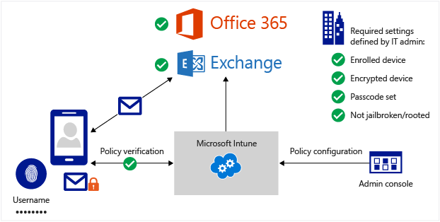

---
# required metadata

title: Email management options
description:
keywords:
author: andredm7
manager: swadhwa
ms.date: 8/1/2016
ms.topic: article
ms.prod:
ms.service: microsoft-intune
ms.technology:
ms.assetid: 9b89da63-039f-4831-b204-28c0681478fe

# optional metadata

#ROBOTS:
#audience:
#ms.devlang:
ms.reviewer: 
ms.suite: ems
#ms.tgt_pltfrm:
#ms.custom:

---

# Email management options

>[!NOTE]
>This topic is part of a larger design considerations guide. If you'd like to start at the beginning of the guide, check out the [main topic](mdm-design-considerations-guide.md). To get a downloadable copy of this entire guide, visit the [TechNet Gallery](https://gallery.technet.microsoft.com/Mobile-Device-Management-7d401582).

The main reason for implementing a mobile device management solution is usually to provide managed access to corporate email from mobile devices. For example, in MDM for Office 365, you can create a [security policy](https://technet.microsoft.com/library/ms.o365.cc.newdevicepolicy.aspx) that provide basic managed access to email mailboxes hosted in Exchange Online or access through Office apps (on iOS and Android). This policy enforces basic mobile device compliance settings, such as requiring a device password and device encryption, before the device is allowed to connect to a user mailbox.

You follow a similar process to configure email management options in Intune, and hybrid Intune and ConfigMgr deployments. The primary difference is that you can implement more advanced email management options than you can in MDM for Office 365. For example, using Intune standalone, you can configure conditional email access to allow access mailboxes hosted on both Exchange Online and Exchange on-premises, as well as configure customized email profiles. Intune enables these features by using configuration and compliance policies.  Hybrid Intune and ConfigMgr deployments also supports conditional email access, but only for mailboxes hosted on Exchange Online

In the scenario shown below in Figure 6, the user has enrolled their device in Intune and is now trying to access their corporate email using Office 365 or Exchange on-premises. Based on the settings defined by the IT administrator at their company, Intune runs a policy verification process. In this scenario, the user’s access is granted if the device is encrypted, a passcode is set, and the device isn’t jail broken or rooted. If a user tries to access corporate email and their device is not enrolled, or not compliant based upon settings defined by the IT admin, the user will receive an email explaining why their access has been blocked along with steps for how to resolve the issue. 

**Conditional access**

Your answers to the questions in Step 1 can help you determine how you want devices to be managed in the mobile device management solution. The lists below outline the advantages and disadvantages of email management for each MDM solution.

## Intune (standalone)

**Advantages**

- Supports email management for all major mobile device operating systems (Android, iOS, Windows 10, Windows 8.x, and Windows Phone)
- Can leverage native mobile device email applications via integration with Exchange ActiveSync
- Integration with Exchange Online via the Service-to-Service connector to allow cross-platform monitoring and reporting between Intune and Office 365
- Supports configuration of email profiles for managing Exchange ActiveSync-based settings on mobile devices
- Conditional email access to resources

**Disadvantages**

- Email profiles aren’t supported for Android-based mobile devices

## MDM for Office 365

**Advantages**

- Allows Exchange ActiveSync support for password, encryption, rooted device compliance
- Allows device management policies and requiring device enrollment before access is granted to Office and OneDrive for Business apps (iOS and Android)
- Conditional email access to resources

**Disadvantages**

- Some advanced email management options aren’t supported 
- Deploying email profiles isn’t supported (except iOS)

## Hybrid (Intune with ConfigMgr)

**Advantages**

- Intune On-premises Connector for hybrid connectivity with Exchange Online
- Integration with Exchange ActiveSync (most strict policy setting is enforced)
- Email profiles
- Conditional access to restrict email access to Exchange Online
- Compliance policies to define the rules and settings the device must comply with in order to be allowed access to the services
- Conditional access policies for each service, define rules for security groups, Intune groups, or how unenrolled devices are managed

**Disadvantages**

- Managed access to email only available for mailboxes hosted on Exchange Online, not mailboxes hosted on Exchange on-premises
- Configuring the service-to-service connector should not be configured if you enable conditional access for both Exchange Online and Exchange on-premises

Explore the details about mobile device email configuration management options by reviewing the following:

- Intune: How to [enable email profiles](/Intune/deploy-use/configure-access-to-corporate-email-using-email-profiles-with-microsoft-intune) and [conditional email access](/Intune/deploy-use/restrict-access-to-email-and-o365-services-with-microsoft-intune)
- ConfigMgr: Enabling [email profiles](https://technet.microsoft.com/library/dn554227.aspx) and [conditional email access](https://technet.microsoft.com/library/dn919655.aspx)
- MDM for Office 365: [Capabilities of mobile device management](https://technet.microsoft.com/library/ms.o365.cc.devicepolicysupporteddevice.aspx)
