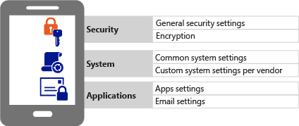

# Hardening mobile devices

>[!NOTE]
>This topic is part of a larger design considerations guide. If you'd like to start at the beginning of the guide, check out the [main topic](mdm-design-considerations-guide.md). To get a downloadable copy of this entire guide, visit the [TechNet Gallery](https://gallery.technet.microsoft.com/Mobile-Device-Management-7d401582).

When creating a configuration baseline for mobile devices to harden its capabilities according to your business needs, make sure that you are balancing usability with security. A very strict hardening template can cause usability and access problems for your employees, which defeats the purpose of helping users be productive by accessing company resources with their devices. 

Also, keep in mind that not all security policies are available for all mobile device platforms. You may need to balance priorities for allowing mobile device platforms in your organization with your security compliance requirements for hardening devices.
One way to approach mobile device hardening is by having different layers of security. The settings that are available for each layer can also vary, depending on your MDM solution. The figure below shows an example of how this layered approach be set up.

## Different areas of mobile device hardening

Each layer can be used to group areas that must be compliant with your business security requirements. For example, you can configure Intune to deploy [security policies](/intune/deployuse/manage-settings-and-features-on-your-devices-with-microsoft-intune-policies) for devices that are specifically for hardening system settings and enable encryption. The policies can also help ensure that only [compliant apps](https://technet.microsoft.com/library/dn818906.aspx) are available to be installed on mobile devices by creating an access white list.

On BYOD devices running Windows 8.1 Enterprise, AppLocker enables you to allow or block an app based on its file path, hash, or properties that persist across application updates (e.g., publisher name, product name, file name, and file version). In Windows 10, a new AppLocker configuration service provider was add to allow you to enable AppLocker rules by using an MDM server. Read [AppLocker CSP](https://msdn.microsoft.com/library/windows/hardware/dn920019(v=vs.85).aspx) for more information on this new capability in Windows 10.

Another area that should be controlled is users’ mobile browsing experience. A managed browser policy includes and allow or block list that restricts the websites that users of the managed browser can visit. Read [Manage Internet access using managed browser policies with Microsoft Intune](/intune/deployuse/manage-internet-access-using-managed-browser-policies) for more information on how to configure these policies in Intune.

In a hybrid environment with ConfigMgr on-premises, you can create a [configuration baseline](https://technet.microsoft.com/library/gg712268.aspx?WT.mc_id=Blog_EntMob_Showcase_PCIT) to set a basic hardening state for managed mobile devices. You can customize this baseline to include all required settings, and then deploy it to your mobile devices. Compliance settings options vary according to the mobile device platform, so read [Compliance Settings for Mobile Devices in Configuration Manager](https://technet.microsoft.com/library/dn376523.aspx) for more information about the options available for each  device.

[MDM for Office 365](https://technet.microsoft.com/library/ms.o365.cc.devicepolicy.aspx) also has a set of capabilities to assist you in hardening mobile devices for the following categories:

- Security
- Encryption
- Jailbroken
- Managed email profile

Read the article [Capabilities of built-in Mobile Device Management for Office 365](https://technet.microsoft.com/library/ms.o365.cc.devicepolicysupporteddevice.aspx) for more information on how to set up security policies for enforcing these options.

Hardening the mobile device platform plays an important role in keeping your company data protected while allowing users to use their mobile device without compromising security. Use the table below as a reference to assist you choosing the MDM option that best fits your organization’s data hardening requirements.

## Intune (standalone)

**Advantages**

- Allows you to enforce policies for enrolled devices: encryption, malware, apps, emails, email profile, jailbroken, system and security
- Supports policy deployment for major mobile device platforms, including (Android, iOS, Windows 10, Windows 8.x, and Windows Phone)

**Disadvantages**

- Lacks integration with current on-premises MDM platform, will introduce an additional management interface for you to use when managing mobile devices
- Some policies may not be available for some mobile platforms

## MDM for Office 365

**Advantages**

- Allows you to enforce policies for enrolled devices: encryption, apps, jailbroken and security
- Supports policy deployment for major mobile device platforms, including (Android, iOS, Windows 10, Windows 8.x, and Windows Phone)

**Disadvantages**

- Lacks integration with current on-premises MDM platform, will introduce an additional management interface for you to use when managing mobile devices
- Some policies may not be available for some mobile platforms
- Doesn’t allow as much granularity as Intune

## Hybrid (Intune with ConfigMgr)

**Advantages**

- Allows you to enforce policies for enrolled devices: encryption, malware, apps, emails, system, security and jailbroken
- Support policy deployment for major mobile device platforms, including (Android, iOS, Windows 10, Windows 8.x, and Windows Phone)
- Single management console for mobile devices registered from the cloud and on-premises devices

**Disadvantages**

- If your company doesn’t have a current on-premises ConfigMgr infrastructure, it will require resources to plan, install and configure ConfigMgr prior to integration

>[!TIP] Read more about mobile device management settings that you can configure in a Microsoft Intune mobile device security policy at [Mobile device management policy settings for Microsoft Intune](https://technet.microsoft.com/library/dn913730.aspx). 
