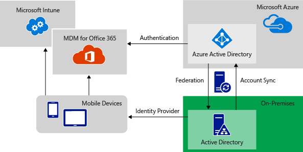

---
# required metadata

title: Identify SaaS connectivity requirements
description: This article helps to identify the Software as a service connectivity requirements when planning to implement mobile device management using Enterprise Mobility + Security solutions.
keywords:
author: andredm7
ms.author: andredm
manager: swadhwa
ms.date: 10/3/2016
ms.topic: solution
ms.prod:
ms.service: 
ms.technology:
ms.assetid: 6afbce4c-7500-4387-a19c-dff52c152097

# optional metadata

#ROBOTS:
#audience:
#ms.devlang:
ms.reviewer: 
ms.suite: ems
#ms.tgt_pltfrm:
ms.custom: microsoft-intune

---

# Identify SaaS connectivity requirements

>[!NOTE]
>This topic is part of a larger design considerations guide. If you'd like to start at the beginning of the guide, check out the [main topic](mdm-design-considerations-guide.md). To get a downloadable copy of this entire guide, visit the [TechNet Gallery](https://gallery.technet.microsoft.com/Mobile-Device-Management-7d401582).

How you connect your on-premises infrastructure will impact of how user and device identity is managed with all MDM solutions: Intune, MDM for Office 365, and hybrid Intune and ConfigMgr deployments. Both Intune and MDM for Office 365 leverage the directory services architecture provided by Azure Active Directory Services. This integration with Azure gives you a lot of flexibility when you're designing identity management support in your mobile device management solution.

As shown in the lists below, connecting your on-premises directory services with Azure is the key requirement for enabling single sign-on and unified directory account management. Single sign-on makes it much easier for your users to connect to company resources that are on-premises and in the cloud. Having a single place to manage accounts makes it easier for administrators. For mobile access, synchronizing directory account attributes and credentials between Azure and on-premises directory services allows users to authenticate on their mobile devices for accessing resources that are managed by either MDM for Office 365 or Intune.

**Overview of integrated identity management**

Depending on how you answered the questions in Task 2, you should be able to determine how the SaaS solution needs to connect to your on-premises client management platform for your mobile device management solution. The lists below will help you understand the advantages and disadvantages of connecting your on-premises infrastructure with a SaaS solution.

## Intune (standalone)

**Advantages**

- Tightly integrated with Azure Active Directory for managing user and device identity and authentication
- Supports user credential self-management and single sign-on experiences that can leverage existing on-premises account credentials
- Supports single sign-on access to thousands of pre-integrated SaaS applications
- Supports application access security by enforcing rules-based multifactor authentication (MFA) for both on-premises and cloud applications

**Disadvantages**

- Advanced directory services connectivity features and functionality require pairing with Azure Active Directory Premium

## MDM for Office 365

**Advantages**

- Integrated with Office 365 tenants, which use the Azure Active Directory backbone for managing user and device identity and authentication
- On-premises directory services can be connected as a part of connecting services with Office 365
- Supports user self-management and single sign-on experiences that can leverage existing on-premises account credentials
- Supports multi-factor authorization for device enrollments by using the Azure MFA service

**Disadvantages**

- Doesn’t support mobile application management integration with other SaaS solutions or applications

## Hybrid (Intune with ConfigMgr)

**Advantages**

- All the advantages of Intune standalone, plus the following:
 - Direct integration with on-premises directory services through ConfigMgr infrastructure

**Disadvantages**

- For organizations that don’t have a current ConfigMgr infrastructure configured, it will need to be planned, installed and configured prior to integrating with Intune
- Requires additional on-premises deployment requirements and configuration changes for organizations with ConfigMgr.
