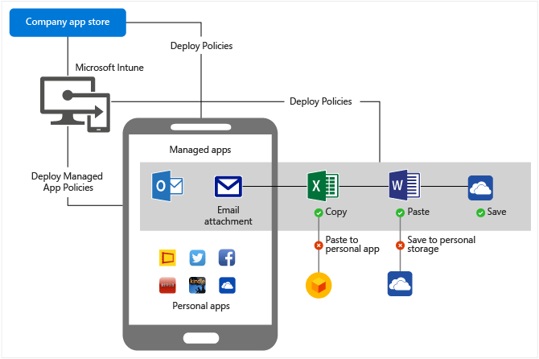

# Protect email and attachments from data leakage
[Architecture guidance for protecting company email and documents](../Solutions/protect-corporate-email-documents.md) talked about how you can make sure that only compliant devices can access corporate email. However, the content in the email and email attachments is not protected just by securing access. The content can be copied, moved, saved to a different location, or shared with another user. EMS solves this problem using mobile application management (MAM) policies.

Managed apps are apps that are deployed by your IT admin that comply with your companies security requirements. With these apps, IT has direct control over deployment, ongoing management like inventory or updates, and selective wipe of the apps and their associated data. Additionally, through a set of mobile application management (MAM) policies, Intune lets you modify the functionality of apps, and restrict sharing of data like:

-   Block copy and paste, or prevent data transfer from a managed app to an app without MAM policy.

-   Prevent backup to personal cloud storage, preventing Save as, etc.

-   Secure app access by requiring PIN/passcode or corporate credentials on a MAM-protected app.

-   Configure the application to open all web links inside the Intune Managed Browser.

-   Selectively wipe only data that is associated with the managed app. When a device is lost, stolen, or is no longer managed by your IT, a selective wipe can remove all corporate data from the apps, leaving only personal app data behind. This is known as multi-identity.

With [Azure Rights Management Services](https://technet.microsoft.com/en-us/library/jj585026.aspx), you can extend email protection in the following ways:

-   Email messages can be encrypted so only the right users can read or view the content whether within your company or outside the company.

-   Users can protect email messages and the recipient can read and use protected email messages sent to them.

-   An administrator can set rules to:

    -   Automatically apply the rules to a specified group of recipients or create templates for specific departments.

    -   Automatically detect and apply rules to email messages with sensitive content. The rule can be based on sender, recipient, message subject, or content.

    -   Detect sensitive content and alert the sender to apply the protection rules before sending the email.

## Managed App Components

-   **Microsoft Intune** is where you configure the policies, associate the policies with the app, or use the app wrapping tool to enable an in-house app to use mobile application management policies.

-   **The Company portal** is an app that either runs natively on each device or is browser based. Your IT deploys the managed apps to users or devices, and end-users can install the app from the portal. The policies associated with the apps are carried over to the device with the apps.

## The IT admin experience:
Your IT admin creates the mobile application management policies, associates the policy to the app, and deploys it to users or devices. When the managed app is installed on the device, the app restrictions take effect. Creating and deploying managed apps involve little or no additional effort:

-   There are existing apps that already have the App SDK which allows you to apply restrictions to the app. These require no other processing, but just adding a link pointing to an app store such as iTunes or Google Play. Read [this](https://technet.microsoft.com/en-us/library/dn708489.aspx) article to see the list of managed apps.

-   If you want to manage apps that are created in-house, you can repackage the apps with Microsoft Intune App Wrapping tool. The tool repackages the app which allows you to apply restrictions to the app.

## The End-user experience
End-users can install managed apps and use them to do their work. They will only be able to move or share data between managed apps. Any attempt to move data out of the managed app ecosystem will be blocked.

## Where to go from here
Now that you understand about [protecting corporate email and documents](../Solutions/protect-corporate-email-documents.md) and email attachments, you can learn about how to [implement a solution to protect your corporate email](../Solutions/implement-solution.md).
