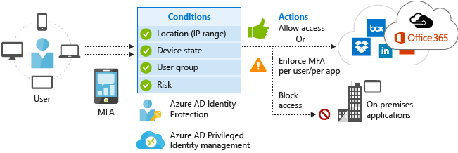
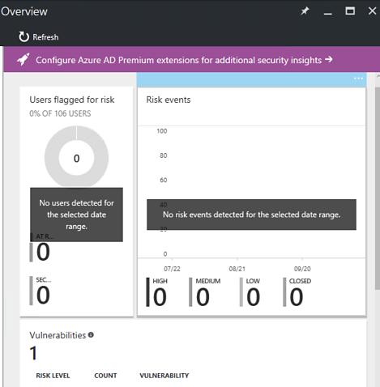
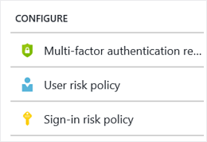
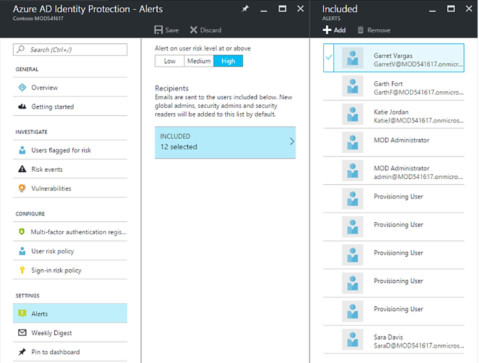
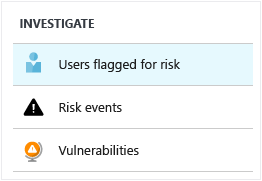
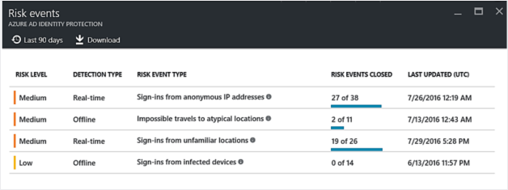
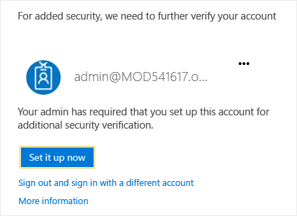
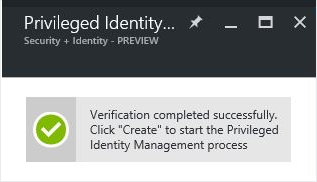
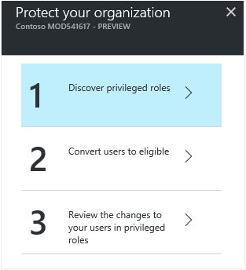
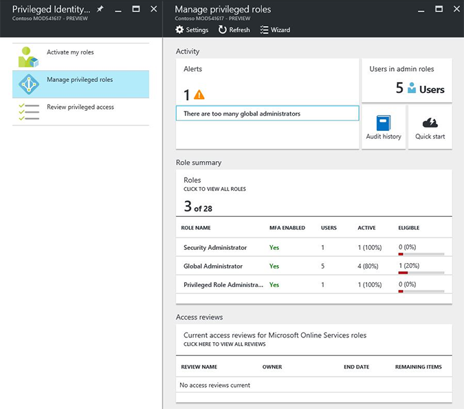

---
# required metadata

title: Protect at the front door | Microsoft Docs
description: A scenario that describes how Enterprise Mobility + Security can be used to protect identity for secure access to company resources by leveraging Microsoft Azure Active Directory Identity Protection and Azure Active Directory Privileged Identity Management capabilities.
author: yuridio
ms.author: yurid
manager: mbaldwin
ms.date: 05/18/2017
ms.topic: solution
ms.prod:
ms.service: active-directory
ms.technology: techgroup-identity
ms.assetid: c9aeabcf-db9b-4a35-b1bc-61331c464165

# optional metadata

#ROBOTS:
#audience:
#ms.devlang:
ms.reviewer: v-craic
ms.suite: ems
#ms.tgt_pltfrm:
ms.custom: microsoft-identity-manager

---

# Protect at the Front Door

Traditional security solutions used to be enough to protect your business. But that was before the mobility industry grew, which created a larger attack landscape, and the transition to the cloud made employees' interactions with other users, devices, apps, and data more complex. To truly protect your business now, you need to take a more holistic and innovative approach to security, one that can protect, detect, and respond to threats of all kinds on-premises as well as in the cloud.

In more than 63 percent of data breaches, attackers gain corporate network access through weak, default, or stolen user credentials.  Microsoft Identity-Driven Security focuses on user credentials, slamming the door shut on credential theft by managing and protecting your identities, including your privileged and non-privileged identities.

## How can Enterprise Mobility + Security help you?

Enterprise Mobility + Security (EMS) security approach starts with one protected common identity for secure access to all corporate resources on-premises and in the cloud with risk-based [conditional access](https://azure.microsoft.com/documentation/articles/active-directory-conditional-access/). By using this approach, IT can safeguard their company’s resources at the front door with innovative and advanced risk-based conditional accesses. EMS provides one protected common identity for accessing thousands of apps, which helps IT to manage and protect privileged identities.

## Recommended solution

To address the requirements of this scenario, EMS uses [Azure AD Identity Protection](https://azure.microsoft.com/documentation/articles/active-directory-identityprotection/) and [Azure AD Privileged Identity Management](https://azure.microsoft.com/documentation/articles/active-directory-privileged-identity-management-configure/). By implementing these technologies, organizations will be able to:

- Gain insights from a consolidated view of machine learning-based threat detection
- Remediate recommendations
- Perform risk severity calculation
- Perform risk-based conditional access automatically to protect against suspicious logins and compromised credentials
- Enforce on-demand, just-in-time administrative access when needed
- Use Alert, Audit Reports, and Access Review

The following diagram summarizes the capabilities involved in this scenario and how they are used to protect your resources:

## How to implement this solution

Follow these steps to implement Azure AD Identity Protection and Azure AD Privileged Identity Management:

- Step 1: Enable Azure AD Identity Protection
- Step 2: Configure Azure AD Identity Protection
- Step 3: Monitor access to resources
- Step 4: Enable Azure AD Privileged Identity Management
- Step 5: Configure Azure AD Privileged Identity Management
- Step 6: Privileged Identity Management operations

## How to Protect your Resources at the Front Door

Different organizations will have different perceptions regarding incident priority. What is critical for one line of business might not be for another. For this reason, you should first learn how Azure AD Identity Protection categorizes the [risk level](https://azure.microsoft.com/documentation/articles/active-directory-identityprotection/#detection-and-risk), which is an indication (High, Medium, or Low) of the severity of the risk event. Azure AD Identity Protection also evaluates the likelihood that a user’s identity was compromised, and assigns its own risk level, which is called [user’s risk level](https://azure.microsoft.com/documentation/articles/active-directory-identityprotection/#what-is-a-user-risk-level). Azure AD Identity Protection will identity a [vulnerability](https://azure.microsoft.com/documentation/articles/active-directory-identityprotection-vulnerabilities/) and assign a risk level to it. There are different [types of risks](https://azure.microsoft.com/documentation/articles/active-directory-identityprotection-risk-events-types/), and each one is ranked according to its criticality. Follow steps 1 to 3 to enable, implement and monitor resources using Azure AD Identity Protection.

The second stage of this solution (steps 4 to 6) will implement Azure Active Directory (AD) Privileged Identity Management to discover, restrict, and monitor privileged identities. Organizations using Azure can [assign roles in Azure AD](https://azure.microsoft.com/documentation/articles/active-directory-assign-admin-roles/), and Azure AD Privileged Identity Management is able to manage [some of these roles](https://azure.microsoft.com/documentation/articles/active-directory-privileged-identity-management-roles/).

### Step 1: Enable Azure AD Identity Protection

Before implementing this solution, ensure that an [Azure AD Premium license](https://azure.microsoft.com/documentation/articles/active-directory-get-started-premium/) is assigned to the end user. In case you are using a federated domain and you want to enforce password change in the cloud to be written back on-premises, you need to enable [password writeback](https://azure.microsoft.com/documentation/articles/active-directory-passwords-getting-started/). After finishing reviewing these requirements, [enable Azure AD Identity Protection](https://azure.microsoft.com/documentation/articles/active-directory-identityprotection-enable/) by installing it from Marketplace. After finishing this installation, you will have access to the Azure AD Identity Protection dashboard, which may appear empty as shown in the following image.

### Step 2: Configure Azure AD Identity Protection

When planning to implement Azure AD Identity Protection, you must start by defining the following policies:

- [Multi-factor authentication registration policy](https://azure.microsoft.com/documentation/articles/active-directory-identityprotection/#multi-factor-authentication-registration-policy): enables IT to enforce multi-factor authentication (MFA) for users.
- [User risk policy](https://azure.microsoft.com/documentation/articles/active-directory-identityprotection/#user-risk-security-policy): enables IT to set a user risk security policy to block users upon sign-in depending on the risk level.
- [Sign-in risk policy](https://azure.microsoft.com/documentation/articles/active-directory-identityprotection/#sign-in-risk-security-policy): enables IT to evaluate the risk to a specific sign-in and based on this result, apply mitigations using predefined conditions and rules.

These policies are located at the Azure AD Identity Protection dashboard, under the **Configure** section as shown in the following screen:

In addition to configure security policies, you can also customize which users will receive alerts. You should use the **Alerts** option under the Settings section in the Azure AD Identity Protection dashboard as shown in the following image:

Noticed that in this configuration, these users are going to receive alerts only if the user risk level is **High**.

### Step 3: Monitor and remediation

Continuous monitoring is an integral part of any secure operations. By leveraging Azure AD Identity Protection [investigation](https://azure.microsoft.com/documentation/articles/active-directory-identityprotection/#investigation) capabilities, IT will gain an insights view of machine learning-based threat detection with notifications and remediation recommendations. You can use Azure AD Identity Protection dashboard to quickly assess your current environment and easily identify issues that should be addressed according to their criticality. Or you can narrow your investigation in the following areas located under the investigate section in the Azure AD Identity Protection dashboard:

Upon investigation of each one of those areas, administrators can take actions to mitigate [users at risk](https://azure.microsoft.com/documentation/articles/active-directory-identityprotection/#mitigating-user-risk-events), or mitigate [sign-in events](https://azure.microsoft.com/documentation/articles/active-directory-identityprotection/#mitigating-sign-in-risk-events). For example, if you identify a security event such as the [impossible travel to atypical locations](https://azure.microsoft.com/documentation/articles/active-directory-identityprotection-risk-events-types/#impossible-travel-to-atypical-locations) (the second event in the following screen), you can take actions to [remediate](https://azure.microsoft.com/documentation/articles/active-directory-identityprotection/#remediating-user-risk-events) this threat, for example by forcing the password to be reset.

You can also leverage [Azure AD Premium access and usage reports](https://azure.microsoft.com/documentation/articles/active-directory-view-access-usage-reports/) to obtain more information regarding a user’s behavior and potential threats.

### Step 4: Enable Azure AD Privileged Identity Management

To have access to Azure AD Privileged Identity Management you must first [install it from Marketplace](https://azure.microsoft.com/documentation/articles/active-directory-privileged-identity-management-getting-started/). Azure AD Privileged Identity Management and Azure Multi-Factor Authentication (MFA) work together to help IT manage access to secure applications and services. After installing Azure AD Privileged Identity Management, a test will be done to verify if you're able to use MFA. When you click the option to verify your account, you will be redirected to a web page where you need to type your credentials. If your account is not MFA enabled yet, you will see a similar message as shown in the following screen:

Click **Set it up now** and follow the wizard. You need to type your mobile or telephone number for verification purpose. Once you finish this wizard, you will see the verification completed message:

### Step 5: Configure Azure AD Privileged Identity Management

The initial configuration is performed using a [Security Wizard](https://azure.microsoft.com/documentation/articles/active-directory-privileged-identity-management-security-wizard/), which has three stages as shown in the **Protect your organization** blade:

In the first stage you will review the [privileged roles](https://azure.microsoft.com/documentation/articles/active-directory-privileged-identity-management-roles/) that were discovered by Azure AD Privileged Identity Management. The second stage has the intent to reduce the number of users in your organization who have permanent privileged role assignments, which directly minimizes your vulnerability to security breaches. The last stage allows you to review the changes to your users in privileged roles.

If during this process you granted another user an administrative role, you made that user eligible to perform on that role, which means that you can [activate that role](https://azure.microsoft.com/documentation/articles/active-directory-privileged-identity-management-how-to-activate-role/) when you need to perform a task that requires for that role.

### Step 6: Privileged Identity Management operations

Now that you have Azure AD Privileged Identity Management installed and configured, you can perform the initial assessment to verify your current role schema and alerts. In the **Privilege Identity Management** blade click **Manage privileged roles** and you will see a similar dashboard as shown in the following image:

In this dashboard, you can see the current activity, such as [security alerts](https://azure.microsoft.com/documentation/articles/active-directory-privileged-identity-management-how-to-configure-security-alerts/) and [access review](https://azure.microsoft.com/documentation/articles/active-directory-privileged-identity-management-how-to-start-security-review/). You can also use this dashboard to [add](https://azure.microsoft.com/documentation/articles/active-directory-privileged-identity-management-how-to-give-access-to-pim/) or [remove](https://azure.microsoft.com/documentation/articles/active-directory-privileged-identity-management-how-to-give-access-to-pim/#remove-another-users-access-rights-for-managing-pim) one or more users' access to Azure AD Privileged Identity Management.
